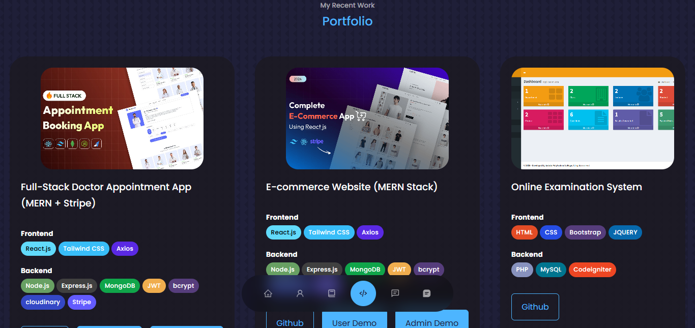

# 💼 Personal Portfolio Website



A modern, responsive, and animated developer portfolio website built using **React.js**, **Framer Motion**, and **EmailJS**. This project showcases my web development projects, skills, contact options, and more — all in one place.

## 🌐 Live Demo

🌍  [Portfolio](https://portfolio-rho-gules-15.vercel.app/)

---

## 📌 Features

- ⚡ Smooth animations with **Framer Motion**
- 📱 Fully responsive on all devices
- 📧 Contact form integration via **EmailJS**
- 🧩 Interactive components with **React Icons**
- 🎨 Styled with custom **CSS and Variables**
- 💡 Project showcase and testimonials section

---

## 🛠️ Tech Stack

| Tech             | Usage                        |
|------------------|-------------------------------|
| React.js         | Frontend framework            |
| Framer Motion    | Animation library             |
| EmailJS          | Contact form message sending  |
| React Icons      | Iconography                   |
| CSS              | Styling and layout            |
| Vite             | Fast build tool for React     |

---

## 🚀 Getting Started

To run the project locally:

```bash
git clone https://github.com/hilla10/my_portfolio_web.git
cd my_portfolio_web
npm install
npm run dev

```
```
my_portfolio_web/
├── public/
│   └── vite.svg
├── src/
│   ├── assets/
│   ├── components/
│   ├── App.jsx
│   ├── index.css
│   └── main.jsx
├── .env
├── .gitignore
├── package.json
└── vite.config.js
```

📜 License
This project is open source and available under the [MIT License](./License).


📬 Contact

  Hailemichael Negusse
  
  📧 hillaman592@gmail.com
  
  📱 +251995491020 / +251967745172

💡 Inspiration
- This project was inspired by modern portfolio designs aimed at helping developers showcase their work and connect professionally.
